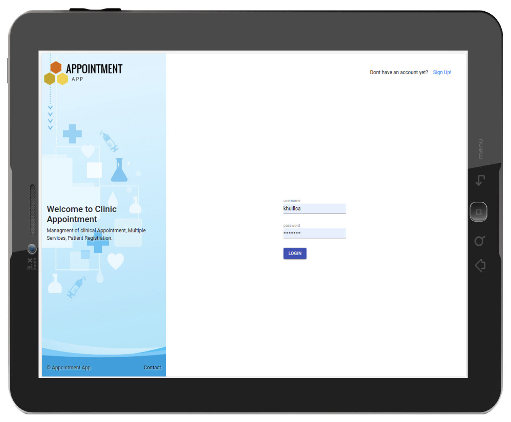
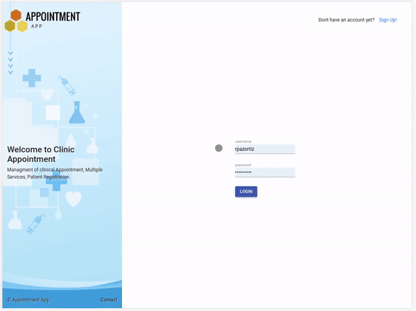
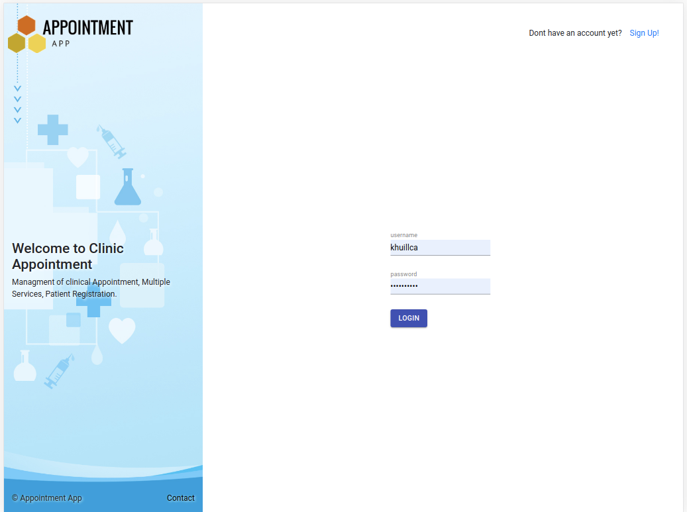
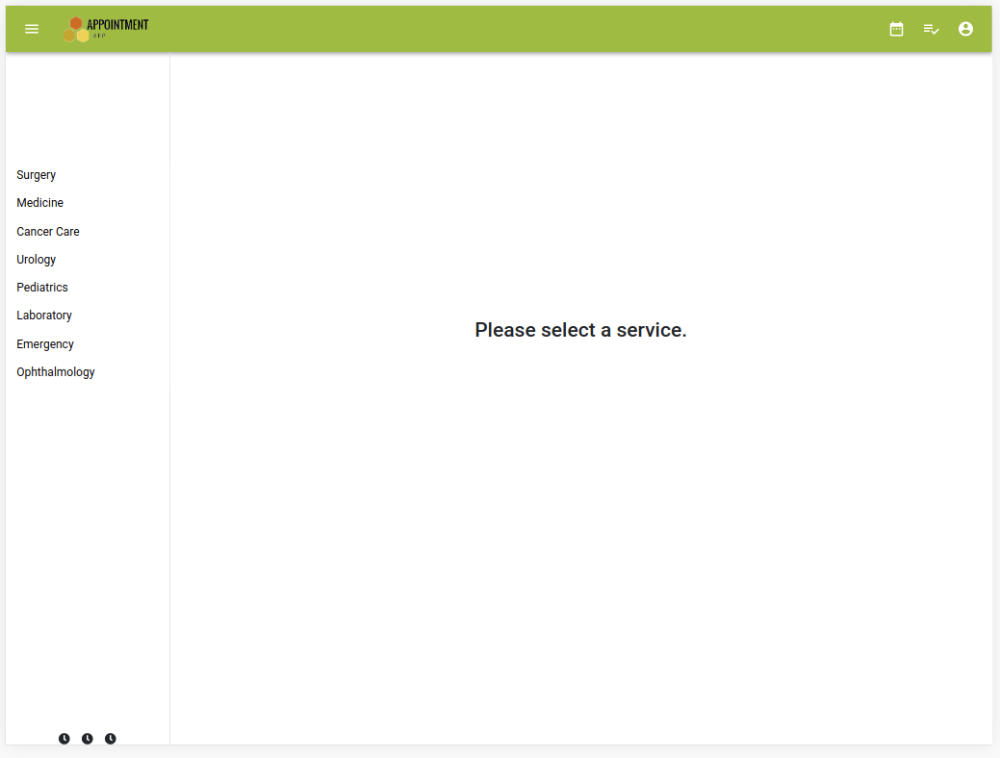
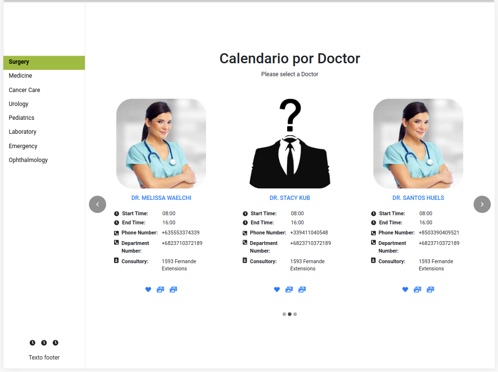
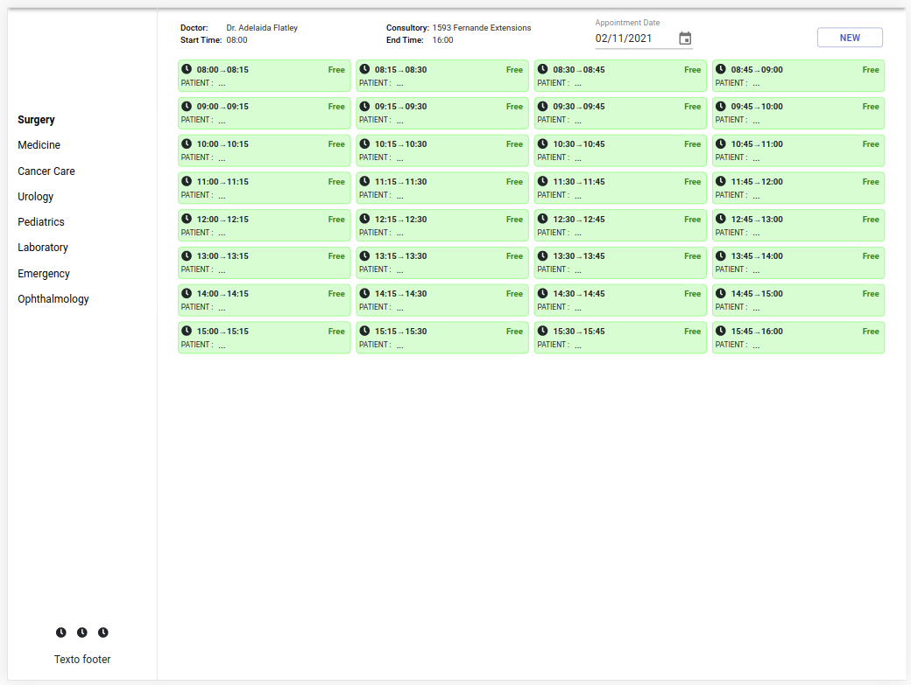
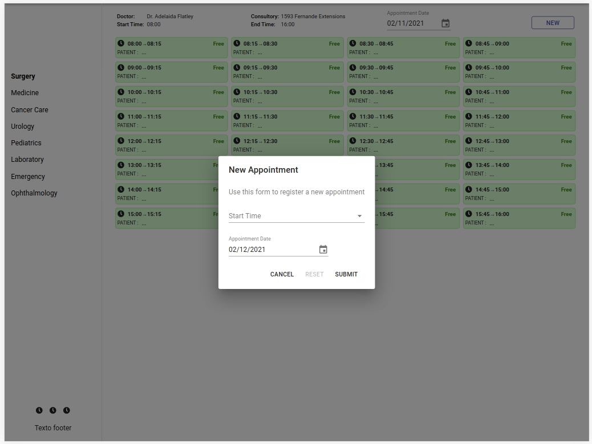

<p align="center">
    
</p>

<p align="center">
    <h1 align="center"> Hospital Appointment System   </h1>    
</p>

<p align="center">
    <h2 align="center"> Web application tablet version to manage hospital appointments</h2>    
</p>
<br />

<p align="center">
    <a href="https://img.shields.io/badge/Microverse-blueviolet" alt="Contributors">
        </a>
    <a href="https://www.w3schools.com/js/js_es6.asp" alt="JavaScript">
        </a>          
    <a href="https://getbootstrap.com/" alt="Bootstrap">
        </a>
    <a href="https://ruby-doc.org/core-2.7.0/Array.html" alt="Ruby">
        </a>
    <a href="https://rubyonrails.org/" alt="Rails">
        </a>
    <a href="https://www.rubydoc.info/gems/bootstrap-sass/3.3.6" alt="Bootstrap-sass">
        </a>
    <a href="https://rspec.info/documentation/" alt="Rspec-rails">
        </a>
    <a href="https://rubygems.org/gems/pg/versions/0.18.4?locale=es" alt="Postgresql">
        </a>
    <a href="https://www.heroku.com/" alt="Heroku">
        </a>
    
</p>

  <p align="center">    
    <br />
    <a href="https://github.com/rubenpazch/appointment-view"><strong>Explore this project »</strong></a>
    <br />
    <br />&#10023;
    <a href="https://agile-lowlands-59460.herokuapp.com/Dashboard">View Demo</a>   &#10023;  
    <a href="https://github.com/rubenpazch/appointment-view/issues">Report Bug</a>    &#10023;
    <a href="#Getting-Started">Getting Started</a> &#10023; <a href="#Install">Installing</a> &#10023;
    <a href="#Extra-Feature">Extra Feature</a> &#10023;
    <a href="#Screenshots-of-the-App">Screenshots of the App</a> &#10023;
    <a href="#Authors">Author</a> &#10023;
    
  </p>


<br/>


Hospital Appointment System is a web application tablet version, this application was build using ROR and <strong>React & Redux</strong> the latest version, includes the ability to register new users, login into the application creating a token session, when we are logged in the application we can select a service (Surgery, Medicine and others), each of the options show different doctors and their attendance availability, finally we can create an appointment for a specific date and service.
<br/>

### Main Features

- Create a new user
- Login with token generation
- Show a list of services as a menu
- Show carousel list of doctor for each service
- Show availability for each doctor
- Create new appointment
- List of appointment by patient


<br/>



<br/>
<br/>

## Getting Started

This project was built using React and Redux, Ruby and Rails API, it is a web application and for running on your local environment you should follow these guidelines.
<br/>
<br/>
**THIS IS THE FRONTEND OF THE APPLICATION AND THE BACKEND IS LOCATED IN THIS LINK** [(backend)](https://github.com/rubenpazch/appointmentAPI)
<br/>

### Prerequisites

- Ruby & Rails
- React & Redux
- Git
- React Testing Library
- CSS modules 
- React Hooks
- Styled components
- Axios

### Setup

The project repository can be found in [GitHub link](https://github.com/rubenpazch/appointment-view/tree/list) or just clone the project using this command. 


```
Using SSH 

# git clone  git@github.com:rubenpazch/appointment-view.git

Using HTTPS

# git clone  https://github.com/rubenpazch/appointment-view.git

```

+ Open terminal on your workspace with

```
cd /home/workspace/appointment-view
```


## Install


To get started with the app, clone the repo, and then install the needed packages using yarn or npm:

```
# npm install or yarn install
```

to start the local application run:

```
# npm start
```


### Usage

To watch the local version of this project check on your browser for the link 

```
Listening on tcp://127.0.0.1:3000
```

### Run tests

Run the test suite to verify that everything is working correctly:

```
# npm test

```

If the test suite passes, you'll be ready to run the app in a local server:


### Deployment

To deploy to netlify just push your changes and create a new project inside netlify, the link your account with github, remenber that you can use 

<b>npm run build or yarn build</b>


## Optional Features

+ For this project it was 
+ stylelint
+ React Testing Library
+ CSS modules 
+ React Hooks

<br/>

## Watch the Live Version

<br/>

click on the link to watch [live version](https://agile-lowlands-59460.herokuapp.com/)

<br/>

click on the link to watch project description [video 1](https://www.notion.so/Final-Capstone-Project-Book-an-Appointment-41ded2ee99ff4fe4becf91acb332ca26)


<br/>


## Screenshots of the App



<br/>

<br/>

<br/>

<br/>



## Contributing

This project was created for educational purposes as part of the Microverse web development curriculum; contributing is not accepted.

Feel free to check the [issues page](https://github.com/rubenpazch/catalogue-of-dog-clothes/issues).


## Authors

👤 **Ruben Paz Chuspe**

- Github: [@rubenpazch](https://github.com/rubenpazch)
- Linkedin: [rubenpch](https://www.linkedin.com/in/rubenpch/)
- Twitter: [@ChuspePaz](https://twitter.com/ChuspePaz)

### Show your support

Give a ⭐️ if you like this project!


## License

This project is licensed under the MIT License - see the [LICENSE.md](LICENSE.md) file for details

## Acknowledgments

* [Creative Commons ](https://creativecommons.org/licenses/by-nc/4.0/)

* [behance.net ](https://www.behance.net/gallery/24531031/Pimp-my-DOG-Online-store-E-commerse-project)
